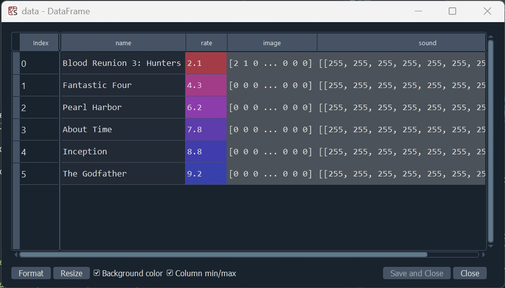
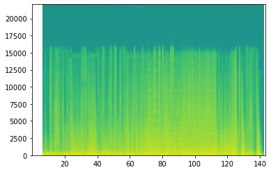
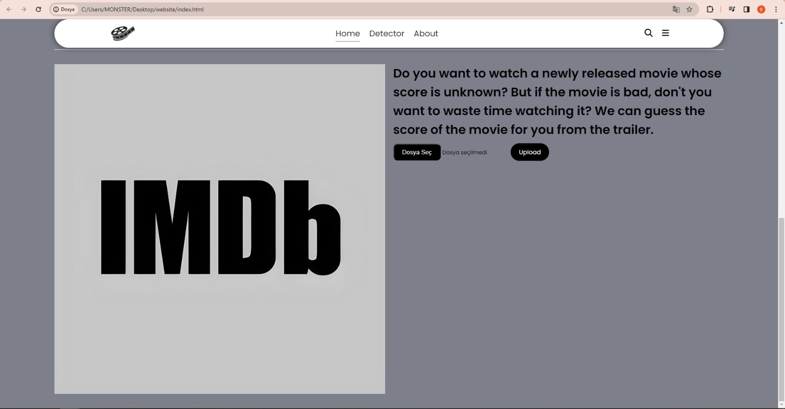
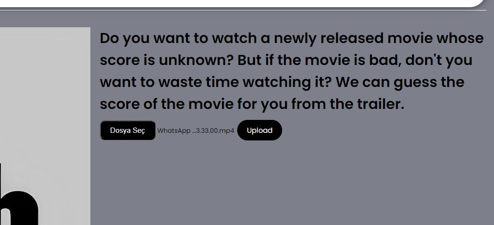

<h1>User guide</h1>
<h3>1. Introduction</h3>
Welcome to our Agent Based Data Acquisition System! This user manual provides information
on how to use and maximize the features

<h3>2. Getting Started</h3>
<h4>2.1 System Requirements</h4>
Depends on which Python version you're using. Minimum 4 GB RAM is needed, check the official
Python website for latest requirements.
<h4>2.2 Installing</h4>

[Download the program that suits you from the site below](https://www.python.org/downloads/)

https://www.python.org/downloads/

<h4>2.3 Python libraries to download</h4>
pandas 1.5.3 
pytube 15.0.0  
googleapiclient 1.62.0 
moviepy 1.0.3 
opencv 4.6.0 
numpy 1.24.3 
matplotlib 3.7 

<h3>3.Data</h3>
Run the codes in the found file

<h4>3.1 Data extraction</h4>
Enter the name of the movie or movies whose data you want to capture

<h4>3.2 Data processing</h4>
The sounds in the trailer will be examined separately and a spectrogram chart will be made for the sounds and recorded in a series format.

<h3>4. User Interface</h3>
<h4>4.1 Dashboard & Home Page</h4>
Dashboard provides an overview of all activities and key features.
<h4>4.2 Detector</h4>
Detector gets the files and uses them for the main goal

<h4>4.3 About</h4>
This section provides additional informations about the system.

<h3>5. Features</h3>

<h4>5.1 Uploading & Detecting</h4>
On the dashboard, navigate to the "Detector" page from the menu or navigation bar. Click the
"File Selection" button, select the movie file in ".mp4" format, from your computer. This process
uploads your selection into the system. 

<h4>5.2 Prediction</h4>
Upload the movie you chose to the website by clicking the "Upload" or "Download" button. Once
the installation is complete, review the information provided by the website. There will be
prediction results, movie score or similar details. You can check, compare or use them.

<h3>6. Troubleshooting</h3>

<h4>6.1 Common Issues</h4>
Check your internet connection.
Ensure your system meets the minimum requirements.

<h4>6.2 FAQ/<h4> 
- Why my page is not loading? 
+ Please check your Internet connection. Make sure that youe device is connected to Internet.
    
- Why the system is not working properly? 
+ Check your system requirements & compare them with the minimum requirements. If this is
not the case, then simply check the libraries that referred in the "Installation" section are
completely installed.  
- Why can't I get proper results? 
+ Consider restrictions such as file size and type. The system may support certain file types and
sizes.  
- Why am I getting my results lately? 
+ Processing time may vary depending on the size of the user's file. Please be patient  

<h3>7. Technical Support<h3>

<h4>7.1 Contact Informations</h4>
You can get in touch with our development team via e-mail or something else.
<h4>7.2 Community</h4>
Join our community to connect & get in touch with other users
